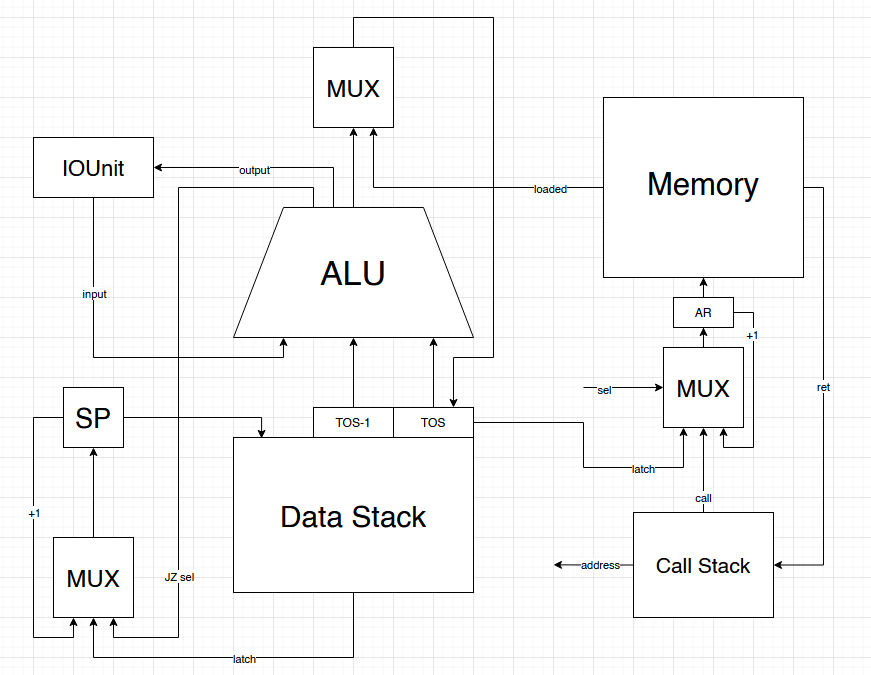
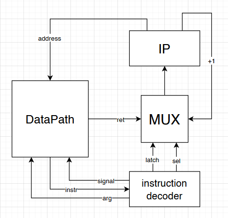

# Лабораторная работа №3
---
Глебов Андрей Станиславович P3212\
`forth | stack | neum | hw | instr | struct | stream | port | cstr | prob1`\
(Вариант с упрощением)
---
## Язык программирования
### Синтаксис
Форма Бэкуса-Наура:
```
<name> ::= [A-Za-z_]+
<variable> ::= <name>
<def_variable> ::= <name>"="<number>
<set_variable> ::= <number> "="<name>
<variables> ::= <def_variable> | <set_variable> | <variable>
<number> ::= [0-9]+
<def_procedure> ::= <name>":" <term> "ret"
<call_procedure> ::= "/"<name>
<procedures> ::= <def_procedure> | <call_procedure>
<string_print> ::= ".'"<text>"'"
<term> ::= <numbers> | <variables> | <prrocedures> | <string_prints>
<operator> ::= "+" | "-" | "*" | "/" | "%" | "." | "!" | in | drop | halt
<compare> ::= ">" | "<" | "=="
<if_then> ::= <compare> "if" <term> "then"
<if_else> ::= <compare> "if" <term> "else" <term> "then"
<loop> ::= <name> <number> "+" | "-" "loop" <term> "loopend"
```
### Операторы
- ``+`` - сумма двух чисел с вершины стека, ``[... a b] -> [... a+b]``
- ``-`` - разность двух чисел с вершины стека, ``[... a b] -> [... a-b]``
- ``*`` - умножение двух чисел с вершины стека, ``[... a b] -> [... a*b]``
- ``/`` - деление двух чисел с вершины стека, ``[... a b] -> [... a/b]``
- ``%`` - остаток от деления двух чисел с вершины стека, ``[... a b] -> [... a%b]``
- ``.`` - вывод числа с вершины стека, ``[... a] -> [output a]``
- ``!`` - разыменование числа с вершины стека, ``[... a] -> [... mem(a)]``
- ``in`` - считывание ввода и помещение на вершину стека, ``[...] -> [... input]``
- ``drop`` - удаление числа с вершины стека, ``[... a] -> [...]``
- ``halt`` - команда останова
- ``<``,  ``>``, ``==`` - сравнение двух чисел с вершины стека, если верно - результат 1, в противном 0, ``[... a b] -> [... a b a<b]``, ``[... a b] -> [... a b a>b]``,``[... a b] -> [... a b a==b]``
- ``<имя переменной>`` - положить адрес переменной на вершину стека
- ``=<имя переменной>`` - присвоить значение с вершины стека выбранной переменной, ``[... a] -> [... a]``
- ``.'<строка>'`` - вывод строки, указанной в кавычках
- ``<название процедуры>: <команды> ret`` - объявление процедуры, дальнейшие вызовы будут выполнять команды и возвращаться в основной код
- ``/<название процедуры>`` - вызов процедуры
- ``<имя переменной> <конечное значение> < +/- > loop <команды> loopend`` - исполнить команды внутри цикла и выполняет операцию инкремента/декремента, пока выбранная переменная не дойдёт до конечного значения (нач. - включительно, кон. - не включительно).
- ``<оператор сравнения> if <команды 1> then`` - выполнить команды 1, если результат оператора сравнения - 1.
- ``<оператор сравнения> if <команды 1> else <команды 2> then`` - выполнить команды 1, если результат оператора сравнения - 1, в противном случае выполнить команды 2.
## Организация памяти
Архитектура Фон-Неймана, то есть память данных и команд общая.
В ячейке 0 находится команда перехода на начало программы, c 1 до 249 находится код функций и программы, 250-499 - значения переменных, а дальше строки.
```
            Memory
+------------------------------+
| 0  : jmp N                   |
|    ...                       |
|    <function code>           |
|    ...                       |
| n   : program start          |
| n+1 : program                |
|    ...                       |
| 250 : variables              |
| 251 : variables              |
|    ...                       |
| 500 : strings                |
| 501 : strings                |
|    ...                       |
+------------------------------+
```
Строки хранятся по одному символу в ячейке и заканчиваются нулём.\
Получение данных из памяти происходит по адресу на вершине стека.\
\
Стек данных - в него кладутся данные (число) при выполнении операций.\
Стек вызовов - в него кладётся адрес выхода из точки кода в процедуру при её вызове, и вынимается назад при выходе из процедуры.\
## Система команд
Машинное слово - передаётся как словарь. Получение инструкции из памяти получается через регистр IP, который можно либо защёлкнуть на один вверх, либо на конкретный адрес во время перехода. Защёлкивание IP на один вверх происходит всегда, когда не происходит переход.
```
{
  "opcode": "jumpzero", 
  "source": "i 2000000000 + loop", 
  "arg": 16
}
```
``opcode`` - код операции\
``source`` - часть кода, вызывающая операцию\
``arg`` - аргумент
## Транслятор
Транcлятор: [translator.py](translator.py)\
Использование в командной строке: ``translator.py <input_file> <target_file>``\
input_file - файл с кодом\
target_file - файл для вывода машинного кода\
Использование с import: вызвать функцию parse_all() с текстом кода.
## Модель процессора
### DataPath

- DataStack - cтек данных
- CallStack - стек адресов выхода из функций
- IOUnit - устройство ввода-вывода
- ALU - арифметико-логическое устройство
- AR - регистр адреса
- SP - указатель на вершину стека
- MUX - мультиплексор
- TOS - вершина стека (top of stack), TOS-1 - элемент перед вершиной
### ControlUnit

- IP - указатель на инструкцию
### Особенности работы
- Моделирование на уровне инструкций, hardwired
- Количество инструкций ограничено
- Моделирование остнавливается при команде halt, ошибке конца буфера ввода или достижения лимита инструкий
- Журнал логирования сохраняет состояния по инструкциям
## Тестирование
Тестирование выполняется скриптом [test_runner.py](test_runner.py)
Тестирование в командной строке:
``test_runner.py <code_file> <test_file> <output_file> <logs_file>``
Golden-тесты (``test_runner.py <test_name>``)
- cat ([code](golden_tests/tests/cat.leaf)|[input](golden_tests/tests/cat.json)) - копирует символы из ввода в вывод
- hello ([code](golden_tests/tests/hello.leaf)|[input](golden_tests/tests/hello.json)) - выводит 'hello world!'
- hello_user_name ([code](golden_tests/tests/hello_user_name.leaf)|[input](golden_tests/tests/hello_user_name.json)) - получает из ввода имя пользователя и приветствует его
- prob1 ([code](golden_tests/tests/prob1.leaf)|[input](golden_tests/tests/prob1.json)) - находит сумму всех чисел, кратных 3 и 5 и строго меньше 1000

CI скрипт ([ссылка](.github/workflows/git_mypy.yaml)):
```
name: Mypy lint and test

on:
  push:
    branches:
      - main
  pull_request:
    branches:
      - main

jobs:
  mypy:
    runs-on: windows-latest

    steps:
      - name: Checkout code
        uses: actions/checkout@v3
      
      - name: install mypy
        run: |
          python -m pip install --upgrade pip
          pip install mypy

      - name: lint
        run: |
          mypy op_lib.py rake.py stack_machine.py test_runner.py translator.py
      
      - name: test
        run: |
          python test_runner.py cat
          python test_runner.py hello
          python test_runner.py hello_user_name
          python test_runner.py prob1
```
Прогон работы test:
```
python test_runner.py cat
python test_runner.py hello
python test_runner.py hello_user_name
python test_runner.py prob1

(golden_tests/tests/cat.json, golden_tests/tests/cat.leaf) output: 'Hello', expected: 'Hello', OK
(golden_tests/tests/hello.json, golden_tests/tests/hello.leaf) output: 'hello world', expected: 'hello world', OK
(golden_tests/tests/hello_user_name.json, golden_tests/tests/hello_user_name.leaf) output: 'What is your name? Hello, Alice!', expected: 'What is your name? Hello, Alice!', OK
(golden_tests/tests/prob1.json, golden_tests/tests/prob1.leaf) output: '233168', expected: '233168', OK
```

Запуск теста cat:
```
PS D:\Programming\Python\Rake\RAKE> cat golden_tests/tests/cat.leaf
i=0 
i 2000000000 + loop
    in
    .
loopend
PS D:\Programming\Python\Rake\RAKE> & C:/Users/xfutu/AppData/Local/Programs/Python/Python38/python.exe translator.py golden_tests/tests/cat.leaf golden_tests/output/cat.dat
PS D:\Programming\Python\Rake\RAKE> cat golden_tests/output/cat.dat
[{"index": 0, "value": {"opcode": "jump", "arg": 1, "source": "<generated>"}},
{"index": 1, "value": {"opcode": "push", "arg": 250, "source": "i 2000000000 + loop"}},
{"index": 2, "value": {"opcode": "load", "source": "i 2000000000 + loop"}},
{"index": 3, "value": {"opcode": "push", "arg": 2000000000, "source": "i 2000000000 + loop"}},
{"index": 4, "value": {"opcode": "lst", "source": "i 2000000000 + loop"}},
{"index": 5, "value": {"opcode": "pop", "source": "i 2000000000 + loop"}},
{"index": 6, "value": {"opcode": "pop", "source": "i 2000000000 + loop"}},
{"index": 7, "value": {"opcode": "jumpzero", "source": "i 2000000000 + loop", "arg": 16}},
{"index": 8, "value": {"opcode": "input", "source": "in"}},
{"index": 9, "value": {"opcode": "output", "source": "."}},
{"index": 10, "value": {"opcode": "push", "arg": 250, "source": "loopend"}},
{"index": 11, "value": {"opcode": "load", "source": "loopend"}},
{"index": 12, "value": {"opcode": "inc", "source": "loopend"}},
{"index": 13, "value": {"opcode": "save", "arg": 250, "source": "loopend"}},
{"index": 14, "value": {"opcode": "pop", "source": "loopend"}},
{"index": 15, "value": {"opcode": "jump", "source": "loopend", "arg": 1}},
{"index": 16, "value": {"opcode": "halt", "source": "<generated>"}}]
PS D:\Programming\Python\Rake\RAKE> cat golden_tests/tests/cat.txt 
['H', 'e', 'l', 'l', 'o']
PS D:\Programming\Python\Rake\RAKE> & C:/Users/xfutu/AppData/Local/Programs/Python/Python38/python.exe stack_machine.py golden_tests/tests/cat.txt golden_tests/output/cat.dat golden_tests/output/cat.log
PS D:\Programming\Python\Rake\RAKE> cat golden_tests/output/cat.log
[{"ip": 1, "tick": 1, "sp": 0, "cp": 0, "alu": 0, "instr": "push", "term": "i 2000000000 + loop"},
{"ip": 2, "tick": 2, "sp": 1, "cp": 0, "alu": 0, "instr": "load", "term": "i 2000000000 + loop"},       
{"ip": 3, "tick": 5, "sp": 1, "cp": 0, "alu": 0, "instr": "push", "term": "i 2000000000 + loop"},       
{"ip": 4, "tick": 6, "sp": 2, "cp": 0, "alu": 0, "instr": "lst", "term": "i 2000000000 + loop"},        
{"ip": 5, "tick": 8, "sp": 2, "cp": 0, "alu": true, "instr": "pop", "term": "i 2000000000 + loop"},     
{"ip": 6, "tick": 9, "sp": 1, "cp": 0, "alu": true, "instr": "pop", "term": "i 2000000000 + loop"},
{"ip": 7, "tick": 10, "sp": 0, "cp": 0, "alu": true, "instr": "jumpzero", "term": "i 2000000000 + loop"},
{"ip": 8, "tick": 11, "sp": 0, "cp": 0, "alu": true, "instr": "input", "term": "in"},
{"ip": 9, "tick": 13, "sp": 1, "cp": 0, "alu": "H", "instr": "output", "term": "."},
{"ip": 10, "tick": 15, "sp": 1, "cp": 0, "alu": "H", "instr": "push", "term": "loopend"},
{"ip": 11, "tick": 16, "sp": 2, "cp": 0, "alu": "H", "instr": "load", "term": "loopend"},
{"ip": 12, "tick": 19, "sp": 2, "cp": 0, "alu": "H", "instr": "inc", "term": "loopend"},
{"ip": 13, "tick": 21, "sp": 2, "cp": 0, "alu": 1, "instr": "save", "term": "loopend"},
{"ip": 14, "tick": 22, "sp": 2, "cp": 0, "alu": 1, "instr": "pop", "term": "loopend"},
{"ip": 15, "tick": 23, "sp": 1, "cp": 0, "alu": 1, "instr": "jump", "term": "loopend"},
{"ip": 1, "tick": 24, "sp": 1, "cp": 0, "alu": 1, "instr": "push", "term": "i 2000000000 + loop"},      
{"ip": 2, "tick": 25, "sp": 2, "cp": 0, "alu": 1, "instr": "load", "term": "i 2000000000 + loop"},      
{"ip": 3, "tick": 28, "sp": 2, "cp": 0, "alu": 1, "instr": "push", "term": "i 2000000000 + loop"},      
{"ip": 4, "tick": 29, "sp": 3, "cp": 0, "alu": 1, "instr": "lst", "term": "i 2000000000 + loop"},       
{"ip": 5, "tick": 31, "sp": 3, "cp": 0, "alu": true, "instr": "pop", "term": "i 2000000000 + loop"},    
{"ip": 6, "tick": 32, "sp": 2, "cp": 0, "alu": true, "instr": "pop", "term": "i 2000000000 + loop"},    
{"ip": 7, "tick": 33, "sp": 1, "cp": 0, "alu": true, "instr": "jumpzero", "term": "i 2000000000 + loop"},
{"ip": 8, "tick": 34, "sp": 1, "cp": 0, "alu": true, "instr": "input", "term": "in"},
{"ip": 9, "tick": 36, "sp": 2, "cp": 0, "alu": "e", "instr": "output", "term": "."},
{"ip": 10, "tick": 38, "sp": 2, "cp": 0, "alu": "e", "instr": "push", "term": "loopend"},
{"ip": 11, "tick": 39, "sp": 3, "cp": 0, "alu": "e", "instr": "load", "term": "loopend"},
{"ip": 12, "tick": 42, "sp": 3, "cp": 0, "alu": "e", "instr": "inc", "term": "loopend"},
{"ip": 13, "tick": 44, "sp": 3, "cp": 0, "alu": 2, "instr": "save", "term": "loopend"},
{"ip": 14, "tick": 45, "sp": 3, "cp": 0, "alu": 2, "instr": "pop", "term": "loopend"},
{"ip": 15, "tick": 46, "sp": 2, "cp": 0, "alu": 2, "instr": "jump", "term": "loopend"},
{"ip": 1, "tick": 47, "sp": 2, "cp": 0, "alu": 2, "instr": "push", "term": "i 2000000000 + loop"},      
{"ip": 2, "tick": 48, "sp": 3, "cp": 0, "alu": 2, "instr": "load", "term": "i 2000000000 + loop"},      
{"ip": 3, "tick": 51, "sp": 3, "cp": 0, "alu": 2, "instr": "push", "term": "i 2000000000 + loop"},      
{"ip": 4, "tick": 52, "sp": 4, "cp": 0, "alu": 2, "instr": "lst", "term": "i 2000000000 + loop"},       
{"ip": 5, "tick": 54, "sp": 4, "cp": 0, "alu": true, "instr": "pop", "term": "i 2000000000 + loop"},    
{"ip": 6, "tick": 55, "sp": 3, "cp": 0, "alu": true, "instr": "pop", "term": "i 2000000000 + loop"},    
{"ip": 7, "tick": 56, "sp": 2, "cp": 0, "alu": true, "instr": "jumpzero", "term": "i 2000000000 + loop"},
{"ip": 8, "tick": 57, "sp": 2, "cp": 0, "alu": true, "instr": "input", "term": "in"},
{"ip": 9, "tick": 59, "sp": 3, "cp": 0, "alu": "l", "instr": "output", "term": "."},
{"ip": 10, "tick": 61, "sp": 3, "cp": 0, "alu": "l", "instr": "push", "term": "loopend"},
{"ip": 11, "tick": 62, "sp": 4, "cp": 0, "alu": "l", "instr": "load", "term": "loopend"},
{"ip": 12, "tick": 65, "sp": 4, "cp": 0, "alu": "l", "instr": "inc", "term": "loopend"},
{"ip": 13, "tick": 67, "sp": 4, "cp": 0, "alu": 3, "instr": "save", "term": "loopend"},
{"ip": 14, "tick": 68, "sp": 4, "cp": 0, "alu": 3, "instr": "pop", "term": "loopend"},
{"ip": 15, "tick": 69, "sp": 3, "cp": 0, "alu": 3, "instr": "jump", "term": "loopend"},
{"ip": 1, "tick": 70, "sp": 3, "cp": 0, "alu": 3, "instr": "push", "term": "i 2000000000 + loop"},      
{"ip": 2, "tick": 71, "sp": 4, "cp": 0, "alu": 3, "instr": "load", "term": "i 2000000000 + loop"},      
{"ip": 3, "tick": 74, "sp": 4, "cp": 0, "alu": 3, "instr": "push", "term": "i 2000000000 + loop"},      
{"ip": 4, "tick": 75, "sp": 5, "cp": 0, "alu": 3, "instr": "lst", "term": "i 2000000000 + loop"},       
{"ip": 5, "tick": 77, "sp": 5, "cp": 0, "alu": true, "instr": "pop", "term": "i 2000000000 + loop"},    
{"ip": 6, "tick": 78, "sp": 4, "cp": 0, "alu": true, "instr": "pop", "term": "i 2000000000 + loop"},    
{"ip": 7, "tick": 79, "sp": 3, "cp": 0, "alu": true, "instr": "jumpzero", "term": "i 2000000000 + loop"},
{"ip": 8, "tick": 80, "sp": 3, "cp": 0, "alu": true, "instr": "input", "term": "in"},
{"ip": 9, "tick": 82, "sp": 4, "cp": 0, "alu": "l", "instr": "output", "term": "."},
{"ip": 10, "tick": 84, "sp": 4, "cp": 0, "alu": "l", "instr": "push", "term": "loopend"},
{"ip": 11, "tick": 85, "sp": 5, "cp": 0, "alu": "l", "instr": "load", "term": "loopend"},
{"ip": 12, "tick": 88, "sp": 5, "cp": 0, "alu": "l", "instr": "inc", "term": "loopend"},
{"ip": 13, "tick": 90, "sp": 5, "cp": 0, "alu": 4, "instr": "save", "term": "loopend"},
{"ip": 14, "tick": 91, "sp": 5, "cp": 0, "alu": 4, "instr": "pop", "term": "loopend"},
{"ip": 15, "tick": 92, "sp": 4, "cp": 0, "alu": 4, "instr": "jump", "term": "loopend"},
{"ip": 1, "tick": 93, "sp": 4, "cp": 0, "alu": 4, "instr": "push", "term": "i 2000000000 + loop"},      
{"ip": 2, "tick": 94, "sp": 5, "cp": 0, "alu": 4, "instr": "load", "term": "i 2000000000 + loop"},      
{"ip": 3, "tick": 97, "sp": 5, "cp": 0, "alu": 4, "instr": "push", "term": "i 2000000000 + loop"},      
{"ip": 4, "tick": 98, "sp": 6, "cp": 0, "alu": 4, "instr": "lst", "term": "i 2000000000 + loop"},       
{"ip": 5, "tick": 100, "sp": 6, "cp": 0, "alu": true, "instr": "pop", "term": "i 2000000000 + loop"},   
{"ip": 6, "tick": 101, "sp": 5, "cp": 0, "alu": true, "instr": "pop", "term": "i 2000000000 + loop"},   
{"ip": 7, "tick": 102, "sp": 4, "cp": 0, "alu": true, "instr": "jumpzero", "term": "i 2000000000 + loop"},
{"ip": 8, "tick": 103, "sp": 4, "cp": 0, "alu": true, "instr": "input", "term": "in"},
{"ip": 9, "tick": 105, "sp": 5, "cp": 0, "alu": "o", "instr": "output", "term": "."},
{"ip": 10, "tick": 107, "sp": 5, "cp": 0, "alu": "o", "instr": "push", "term": "loopend"},
{"ip": 11, "tick": 108, "sp": 6, "cp": 0, "alu": "o", "instr": "load", "term": "loopend"},
{"ip": 12, "tick": 111, "sp": 6, "cp": 0, "alu": "o", "instr": "inc", "term": "loopend"},
{"ip": 13, "tick": 113, "sp": 6, "cp": 0, "alu": 5, "instr": "save", "term": "loopend"},
{"ip": 14, "tick": 114, "sp": 6, "cp": 0, "alu": 5, "instr": "pop", "term": "loopend"},
{"ip": 15, "tick": 115, "sp": 5, "cp": 0, "alu": 5, "instr": "jump", "term": "loopend"},
{"ip": 1, "tick": 116, "sp": 5, "cp": 0, "alu": 5, "instr": "push", "term": "i 2000000000 + loop"},     
{"ip": 2, "tick": 117, "sp": 6, "cp": 0, "alu": 5, "instr": "load", "term": "i 2000000000 + loop"},     
{"ip": 3, "tick": 120, "sp": 6, "cp": 0, "alu": 5, "instr": "push", "term": "i 2000000000 + loop"},     
{"ip": 4, "tick": 121, "sp": 7, "cp": 0, "alu": 5, "instr": "lst", "term": "i 2000000000 + loop"},      
{"ip": 5, "tick": 123, "sp": 7, "cp": 0, "alu": true, "instr": "pop", "term": "i 2000000000 + loop"},   
{"ip": 6, "tick": 124, "sp": 6, "cp": 0, "alu": true, "instr": "pop", "term": "i 2000000000 + loop"},   
{"ip": 7, "tick": 125, "sp": 5, "cp": 0, "alu": true, "instr": "jumpzero", "term": "i 2000000000 + loop"},
{"ip": 8, "tick": 126, "sp": 5, "cp": 0, "alu": true, "instr": "input", "term": "in"}]
Output: Hello
```

```table
| ФИО                         | <алг>           | <LoC> | <code инстр.> | <инстр.> | <такт.> |
| Глебов Андрей Станиславович | cat             | 5     | 17            | 84       | 128     |
| Глебов Андрей Станиславович | hello           | 1     | 3             | 3        | 253     |
| Глебов Андрей Станиславович | hello_user_name | 1     | 29            | 138      | 24      |
| Глебов Андрей Станиславович | prob1           | 23    | 62            | 48826    | 71141   |
```